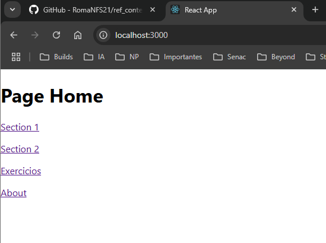
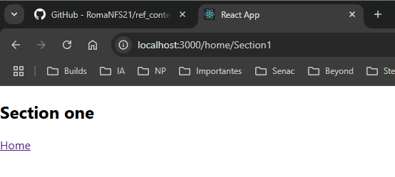
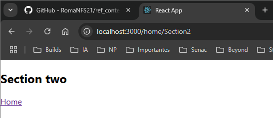
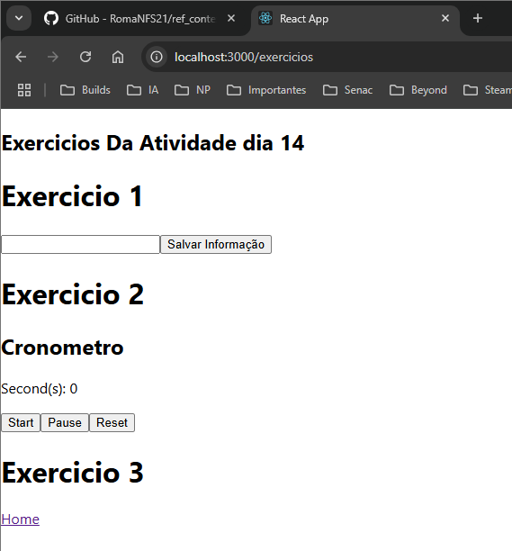
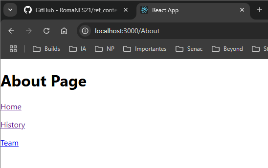
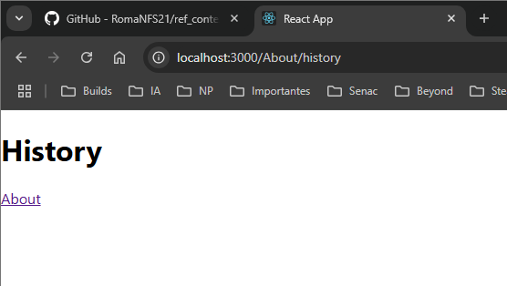
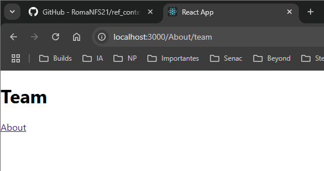

14/01/25 EXERCICIO AULA 21

# Exercicio 1

- Criado o componente Exercicio1 aonde foi solicitado criar um campo de texto e um botão em que ao ser clicado a informação contida no campo de texto
- importado o componente Exercico1 no App.js e colocado para ser renderizado

# Exercicio 2

- Criado o componente Exercicio2 aonde foi solicitado criar um cronometro de segundos com três botões sendo Start para começar o cronometro, Pause para pausar o cronometro e Reset para pausar e resetar o cronometro
- importado o componente Exercico2 no App.js e colocado para ser renderizado

# Exercicio 3

- Implementação do modo escuro pendente

---

15/01/25 EXERCICIO AULA 22

# Exercicio 1

- Solicitado para ser feito paginação
- Realizado a instação da biblioteca **react route dom**
- Criado os componentes para as paginas Home e About aonde em cada uma rederiza um titulo com seus respecitivos nomes
- importado a **react route dom** no App.js e realizado a estruturação de paginas de Home e About

# Exercicio 2

- Criado componentes para sub paginas de Home (section1 e section2) e para About (Team e History) com seus respecitivos titulos para serem rederizados
- adicionado nos componentes Home e About a route para suas sub paginas

---

16/01/25 EXERCICIO AULA 23

- Corrigido as configurações das rotas das sub paginas do Home e About
- Criado nova pagina de componente Exercicios com link a partir do Home
- Implementado Links nas paginas Home, About, Section 1 e 2, Exercicios, Team e Histoy para navegação pelas paginas

